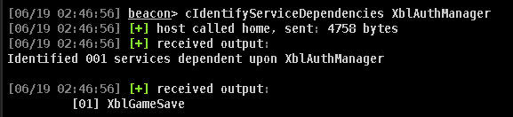
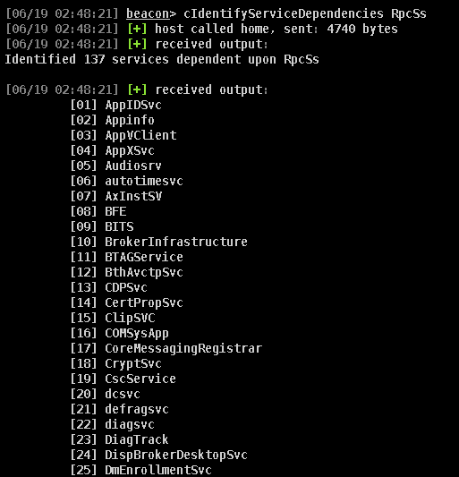

## Identify Dependent Services BOF

A `BOF` to help identify services dependent upon one another, ideally identifying which need to be stopped before a primary.

---

#### Building
```sh
cd src
make all
```
---

#### Usage
1) Load `dist/cIdentifyServiceDependencies.cna`
2) Run in a `Beacon`:
    - `cIdentifyServiceDependencies NAME_OF_SERVICE`
---

#### Outputs




